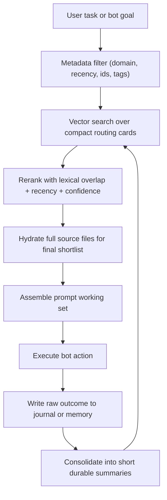

# Memory Embedding Architecture for OpenClaw

## Problem

OpenClaw has outgrown the "embed everything" approach.

Observed in this repo:

- `skills/generated/` contains `20,049` files and about `112.6 MB`.
- The generated skill corpus includes `10,000` `SKILL.md` files, about `23.3 MB` of markdown before counting JSON implementations and reports.
- `cognition-core/reports/` adds another `103.8 MB` of artifacts that are useful for audit/history but poor candidates for direct embedding.

If all of that is embedded as raw text, the vector store spends memory on duplication, generated boilerplate, and long-tail artifacts instead of high-value recall.

## Goal

Maximize recall quality per embedding byte while preserving bot functionality.

The design principle is:

`Vectors route. Source files answer.`

Dense embeddings should decide what to open, not replace the source of truth.

## Recommended Memory Planes

### 1. Raw Source Plane

Keep these unembedded by default:

- full `SKILL.md` files
- `implementation.json` files
- rollout artifacts
- deployability audits
- full task journals
- raw memory markdown entries

This plane is durable, auditable, and cheap to store.

### 2. Routing Plane

Embed only compact routing cards:

- domain cards
- skill cards
- recent memory cards
- durable procedure cards

Each card should be short, stable, and pointer-based.

Example skill routing card:

- title
- domain
- why it matters
- core method
- primary artifact
- pointer to `SKILL.md` and `implementation.json`

### 3. Semantic Memory Plane

Store distilled durable knowledge:

- validated lessons
- reusable procedures
- canonical facts
- stable operator preferences

This plane should be deduplicated and rewritten aggressively. It is the highest-value embedding namespace.

### 4. Working Context Plane

At run time, hydrate only the final candidate set into prompt context:

- top 1 to 3 domains
- top 5 to 20 routing cards
- top 1 to 5 full source files
- top recent memory summaries

Do not hydrate raw artifacts until the routing step is finished.

## Retrieval Flow



## Repo-Specific Guidance

### Skills

Do not embed full generated skills. The repo already has the right primitive for routing:

- [skills/runtime/registry.ts](/Users/zacharywright/Documents/GitHub/OpenClaw-Code/skills/runtime/registry.ts)

It loads manifests first and lazily opens implementations later. Your embedding architecture should mirror that.

Recommended namespaces:

- `skills.domain`
- `skills.route`

### Memory

The memory files in this repo are markdown-first and section-oriented:

- [cognition-core/src/memory-guardrails.ts](/Users/zacharywright/Documents/GitHub/OpenClaw-Code/cognition-core/src/memory-guardrails.ts)

That means you should not embed full raw memory entries forever. Instead:

- keep raw markdown for audit/history
- generate short memory routing cards from title, headings, and compact notes
- periodically consolidate old episodic entries into durable semantic summaries

Recommended namespaces:

- `memory.route`
- `memory.semantic`
- `memory.procedural`

## What To Embed vs Skip

Embed:

- manifest-derived skill routing cards
- domain summaries
- durable lessons learned
- short incident summaries
- canonical procedures

Skip or lazy-load:

- full generated skill markdown
- implementation JSON
- benchmark outputs
- rollout reports
- validation logs
- redundant variants of the same artifact

## Storage Strategy

Use separate stores or namespaces with different retention policies.

### Hot

- recent working memory
- last 7 to 30 days
- high recency weighting

### Warm

- durable memory summaries
- validated procedures
- frequently reused skills

### Cold

- raw logs
- full markdown entries
- archived reports

Cold storage should be addressable by pointer, not by embedding.

## Consolidation Rules

Run a consolidation pass after new outcomes land:

1. Write raw outcome to journal or markdown memory.
2. Detect duplicates by content hash.
3. Extract candidate facts, procedures, and lessons.
4. Merge with existing durable records when semantically equivalent.
5. Re-embed only the compact durable record, not the raw source.

## Query Budget Rules

Apply hard budgets before prompt assembly:

- maximum namespaces per query: `2` or `3`
- maximum routing hits before hydration: `20`
- maximum full documents after hydration: `5`
- maximum raw markdown documents in prompt: `2`

If a request is obviously procedural, skip episodic memory entirely.
If a request is obviously recent-state dependent, bias to `memory.route` and recent journals.

## Immediate Implementation

This repo now includes a compact routing corpus generator:

- [scripts/build-embedding-routing-corpus.ts](/Users/zacharywright/Documents/GitHub/OpenClaw-Code/scripts/build-embedding-routing-corpus.ts)

Run it with:

```bash
npm run embeddings:route-corpus
```

Outputs:

- `skills/state/embedding-routing.skills.jsonl`
- `skills/state/embedding-routing.domains.jsonl`
- `skills/state/embedding-routing.budget.json`

Optional memory routing corpus:

```bash
npm run embeddings:route-corpus -- --memory-root ~/.openclaw/workspace/memory
```

This gives you a much smaller embedding target while keeping pointers back to the original source files.

## Recommended Next Step

Wire your bot retrieval layer to:

1. query `skills.domain` and `skills.route` first
2. hydrate the referenced source files only for shortlisted results
3. write compact durable memory summaries instead of embedding every raw memory file
